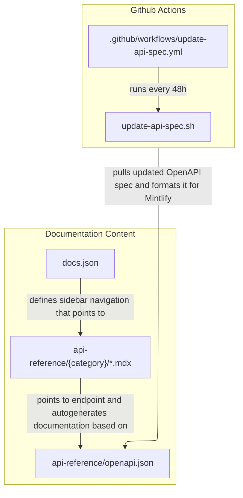

# API Reference Documentation Architecture

This document outlines how the API reference section works.

## Rendering the documentation content

### docs.json

Defines the navigational structure of the docs. The "API" section determines the navigation structure of all the API reference pages. Each path points to an MDX page in `/api-reference`.

### api-reference/{category}/\*.mdx

Each page has an `openapi` attribute that points to an endpoint listed in `api-reference/openapi.json`. Mintlify auto-generates the documantation based on this information.

### api-reference/openapi.json

Contains a copy of the OpenAPI spec that all our API reference pages pull from. Automatically updated every 48 hours by our [Github Actions](https://github.com/checkly/docs/actions/workflows/update-api-spec.yml) workflow.

## Updating `api-reference/openapi.json` via Github Actions

Checkly's public OpenAPI spec can be found here: https://api.checklyhq.com/openapi.json. We have a copy saved to `api-reference/openapi.json` that we update every 48 hours. It's formatted in a way that plays nicely with Mintlify, and all our API reference pages use this file to generate the API reference documentation.

* `.github/workflows/update-api-spec.yml` runs the update script (`update-api-spec.sh`) every 48 hours and commits the changes to `main`. [View all recent runs.](https://github.com/checkly/docs/actions/workflows/update-api-spec.yml)

* The update script (`update-api-spec.sh`) pulls the most recent the OpenAPI spec, cleans it up for use with Mintlify, and applies those edits to `api-reference/openapi.json`.