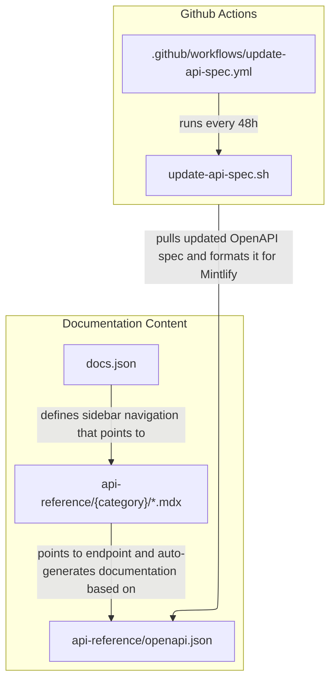

# API Reference Documentation Architecture

This document outlines how the API reference section works.



## Rendering the documentation content

### `docs.json`

Defines the navigational structure of the docs. The "API" section determines the sidebar navigation structure of the API reference. Each path points to an MDX page in `/api-reference`.

### `api-reference/{category}/\*.mdx`

Each page has an `openapi` attribute that points to an endpoint listed in `api-reference/openapi.json`. Mintlify auto-generates the documentation based on this information.

### `api-reference/openapi.json`

Contains a copy of the OpenAPI spec that all our API reference pages pull from. It's automatically updated every 48 hours by our [Github Actions](https://github.com/checkly/docs/actions/workflows/update-api-spec.yml) workflow.

## Updating `api-reference/openapi.json` via Github Actions

Checkly's public OpenAPI spec can be found here: https://api.checklyhq.com/openapi.json. We have a copy saved to `api-reference/openapi.json` that we update every 48 hours. This copy is formatted to play nicely with how Mintlify renders pages, and all our API reference pages use this file to auto-generate the API reference documentation.

* `.github/workflows/update-api-spec.yml` runs the update script (`update-api-spec.sh`) every 48 hours and commits the changes to `main`. [View all recent runs.](https://github.com/checkly/docs/actions/workflows/update-api-spec.yml)

* The update script (`update-api-spec.sh`) pulls the most recent OpenAPI spec, cleans it up for use with Mintlify, and applies those edits to `api-reference/openapi.json`.

## Adding new endpoints

If you need to add an endpoint to an API reference:

1. Create the sidebar navigation item in `docs.json`
2. Create a new file in `api-reference/{category}/\*.mdx`. That file should have an `openapi` attribute that references the corresponding endpoint. You can also define a custom title, if the OpenAPI spec doesn't have a nice one. For example:
```md
---
openapi: get /v1/analytics/api-checks/{id}
title: API checks
---
```

If you need to update your local copy of the OpenAPI spec, run `./update-api-spec.sh`

That's it! Your new endpoint should be showing properly now.
