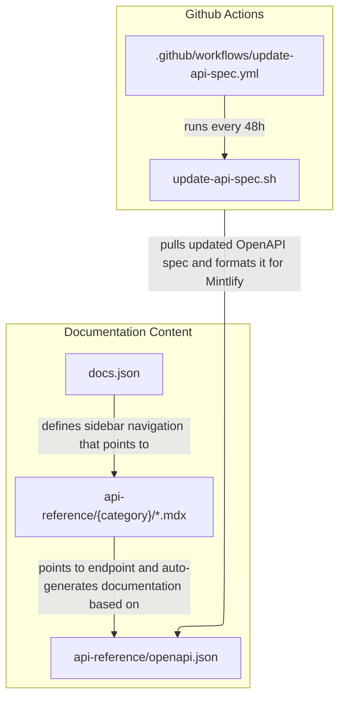

# API Reference Documentation Architecture

This document outlines how the API reference section works.


```mermaid
---
config:
  flowchart:
    defaultRenderer: "elk"
---
flowchart TD
    docs_json["docs.json"]
    mdx_pages["api-reference/{category}/*.mdx"]
    openapi["api-reference/openapi.json"]
    workflow[".github/workflows/update-api-spec.yml"]
    script["update-api-spec.sh"]

    subgraph ci["Github Actions"]
        workflow -->|"runs every 48h"| script
    end

    subgraph docs["Documentation Content"]
        docs_json -->|"defines sidebar navigation that points to"| mdx_pages
    mdx_pages -->|"points to endpoint and auto-generates documentation based on"| openapi
    end
    
    ci -->|"pulls updated OpenAPI spec and formats it for Mintlify"| openapi
```

## Rendering the documentation content

### `docs.json`

Defines the navigational structure of the docs. The "API" section determines the sidebar navigation structure of the API reference. Each path points to an MDX page in `/api-reference`.

Usage v2 and legacy Status Pages entries instead reference a schema operation, such as `"api-reference/openapi.json GET /v2/usage/summary"`. Mintlify generates these pages directly from the schema in their existing navigation positions.

### `api-reference/{category}/\*.mdx`

Each page has an `openapi` attribute that points to an endpoint listed in `api-reference/openapi.json`. Mintlify auto-generates the documentation based on this information.

### `api-reference/openapi.json`

Contains a copy of the OpenAPI spec that all our API reference pages pull from. It's automatically updated every 48 hours by our [Github Actions](https://github.com/checkly/docs/actions/workflows/update-api-spec.yml) workflow.

### Endpoint status badges and warnings

Usage v2 operations declare the Beta badge in `x-mint.metadata.tag`. Legacy Status Pages operations use the standard `deprecated: true` flag, which Mintlify renders as a deprecation label. Both include a native `<Warning>` component through `x-mint.content`. Set this metadata in the backend routes so API spec refreshes preserve it.

The operation's `x-mint.href` preserves its existing page URL. `x-mint.metadata` also carries authored titles, descriptions, and the trailing-slash canonical URL. Keep these URL fields when changing an endpoint's lifecycle status.

Do not add an MDX file at a generated page's URL. Mintlify processes existing MDX files after generating endpoints and would overwrite the schema metadata and content. The shared API navigation tooling checks for this conflict and validates generated canonicals. Sitemap generation, legacy redirect checks, and endpoint discovery resolve these entries through `x-mint.href`.

## Updating `api-reference/openapi.json` via Github Actions

Checkly's public OpenAPI spec can be found here: https://api.checklyhq.com/openapi.json. We have a copy saved to `api-reference/openapi.json` that we update every 48 hours. This copy is formatted to play nicely with how Mintlify renders pages, and all our API reference pages use this file to auto-generate the API reference documentation.

* `.github/workflows/update-api-spec.yml` runs the update script (`update-api-spec.sh`) every 48 hours and commits the changes to `main`. [View all recent runs.](https://github.com/checkly/docs/actions/workflows/update-api-spec.yml)

* The update script (`update-api-spec.sh`) pulls the most recent OpenAPI spec, cleans it up for use with Mintlify, and applies those edits to `api-reference/openapi.json`.

## Adding new endpoints

Choose how the endpoint page is created:

* For a native schema-driven page, declare its `x-mint.href`, canonical, and any custom metadata or content in the backend route. Add an operation reference to `docs.json`, such as `"api-reference/openapi.json GET /v2/usage/summary"`. Endpoint discovery also uses native navigation for new operations that declare `x-mint.href`.
* For an authored MDX page, create a file in `api-reference/{category}/\*.mdx` with an `openapi` attribute referencing the endpoint, and add its file path to `docs.json`.

An authored page can define a custom title. For example:
```md
---
openapi: get /v1/analytics/api-checks/{id}
title: API checks
---
```

If you need to update your local copy of the OpenAPI spec, run `./update-api-spec.sh`

That's it! Your new endpoint should be showing properly now.

## Legacy `/reference/*` redirects

The pre-Mintlify API reference lived on ReadMe.io at `developers.checklyhq.com/reference/<slug>`, where `<slug>` was the lowercased OpenAPI `operationId` (e.g. `getv1checks`). To keep those old deep links alive, `docs.json` carries redirects generated from `.github/reference-slug-map.json` — a **frozen** snapshot of the ReadMe-era slug set. Don't regenerate it from a newer spec: endpoints added after the ReadMe era never had `/reference/` URLs.

* One explicit redirect per historical slug maps to its endpoint page, so old bookmarks deep-link correctly.
* A trailing catch-all `/reference/:slug*` → `/api-reference/overview` backstops slugs whose endpoints were removed after the ReadMe era. Mintlify resolves exact sources before wildcards, so the catch-all never shadows the explicit entries. **If you ever add a real docs page under `/reference/`, this catch-all will intercept it — narrow or remove it first.**
* `mint broken-links` does **not** validate these destinations (nothing links to `/reference/*` in page content), so `.github/scripts/check-redirect-destinations.mjs` runs in the static-docs-checks workflow on every docs PR. It validates destinations against both authored MDX and schema-generated pages.
