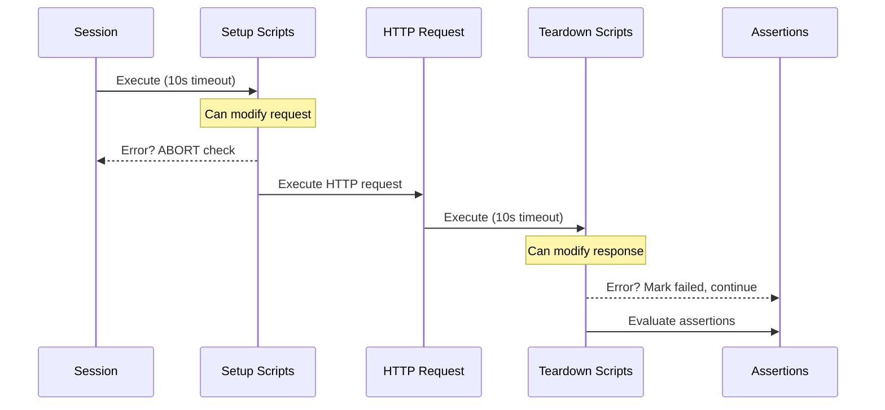

import GenericRuntimeVariablesTable from '/snippets/generic-runtime-variables-table.mdx';
import { YoutubeEmbed } from "/snippets/youtube-embed.jsx"

Setup and teardown scripts execute arbitrary JavaScript/TypeScript code before and after an API check's HTTP request.
Both script types have access to environment variables, runtime objects like `request` and `response`, and popular npm packages
like `moment`, `axios`, and `lodash`.

To get the most power out of API checks with setup and teardown scripts, we advise using [the Checkly CLI](/cli).
You can also use them [via the web UI](#using-setup-and-teardown-scripts-via-the-ui).

> Setup and teardown scripts have a **maximum execution time of 10 seconds** each.

Check the video below for a quick overview of using setup and teardown scripts through the web UI and with the CLI.

<YoutubeEmbed id="38ZXJy-nlvI" title="Monitor complex API endpoints with Checkly API checks" />

## How it works

Setup and teardown scripts run at specific points in the API check lifecycle. Understanding this flow helps you use them effectively.



**Execution order:**

1. Setup scripts run first and can modify the request before it's sent.
2. The HTTP request executes.
3. Teardown scripts run and can access or modify the response.
4. Assertions evaluate against the (possibly modified) response.

## Setup scripts

Setup scripts execute before the HTTP request. Use them to prepare test data, configure request parameters, and handle authentication.

You have access to [built-in variables](#built-in-variables) to modify the HTTP request and a set of [libraries available in each runtime](/platform/runtimes/runtime-specification).

### Modifying the request

You can modify any property of the `request` object:

```ts
// Set a custom header
request.headers['X-Custom-Header'] = 'my value'

// Append a value to the request URL
request.url = request.url + '/extra'

// Set query parameters
request.queryParameters['filter'] = 'active'

// Modify the request body
request.body = JSON.stringify({ userId: 123 })

// Change the HTTP method
request.method = 'POST'
```

### Authentication example

A common task for setup scripts is fetching or signing session tokens. You can centralize this logic and reuse it across API checks.

1. Create an API check and reference the setup script (`setup.ts`) using the `entrypoint` property.
2. Encapsulate authentication logic in a separate `auth-client.ts` file.
3. In the `setup.ts` file, import the auth client and update the `request` object.

Your folder structure:

```
.
|-- api-1.check.ts
|-- setup.ts
`-- common
    `-- auth-client.ts
```

The API check performs a `GET` on an authenticated endpoint:

```ts api.check.ts
import { ApiCheck } from '@checkly/cli/constructs'
import * as path from 'path'

new ApiCheck('api-check-1', {
    name: 'Fetch Product Data',
    setupScript: {
        entrypoint: path.join(__dirname, 'setup.ts'),
    },
    request: {
        method: 'GET',
        url: 'https://api.acme.com/v1/products'
    }
})
```

The setup script uses the auth client and sets the `Authorization` header:

```ts setup.ts
import { getToken } from './common/auth-client'
const token = await getToken()
request.headers['Authorization'] = `Bearer ${token}`
```

The auth client reads a static environment variable for authentication:

```ts common/auth-client.ts
import axios from 'axios'

export async function getToken () {
    console.log('Fetching session token from auth server')
    const { data } = await axios.get('https://api.checklyhq.com/v1/runtimes', {
        headers: {
            authorization: process.env.AUTH_SERVER_TOKEN
        }
    })
    return data.token
}
```

Benefits of this structure:

- Reuse authentication logic across multiple API checks
- Test authentication logic separately from Checkly-specific code

Check our [setup script examples](/detect/synthetic-monitoring/api-checks/examples) for OAuth2, HMAC signing, JWT tokens, and other auth methods.

### Error handling in setup scripts

If a setup script throws an error or times out, the check **aborts immediately**. The HTTP request never executes, and assertions don't run.

```ts
// This error will abort the check
if (!process.env.API_KEY) {
  throw new Error('API_KEY environment variable is required')
}
```

## Teardown scripts

Teardown scripts run after the HTTP request completes but before assertions evaluate. They have access to both the `request` and `response` objects.

Common use cases:

- Cleaning up test data created during the check
- Scrubbing sensitive data from responses before logging
- Normalizing response data for consistent assertions
- Extracting and storing values for subsequent checks

### Accessing the response

The `response` object contains the full HTTP response:

```ts
// Log response details
console.log('Status:', response.statusCode)
console.log('Headers:', JSON.stringify(response.headers))

// Parse JSON body
const body = JSON.parse(response.body)
console.log('User ID:', body.userId)
```

### Modifying the response

You can modify response properties before assertions run. This is useful for scrubbing sensitive data or normalizing inconsistent API responses.

```ts
// Scrubbing sensitive data before logging
const body = JSON.parse(response.body)

if (body.user) {
  body.user.ssn = '[REDACTED]'
  body.user.creditCard = '[REDACTED]'
}

response.body = JSON.stringify(body)
```

```ts
// Normalizing timestamps for consistent assertions
const body = JSON.parse(response.body)

// Replace dynamic timestamps with a static value
body.createdAt = '2024-01-01T00:00:00Z'
body.updatedAt = '2024-01-01T00:00:00Z'

response.body = JSON.stringify(body)
```

### Cleaning up test data

If your setup script creates test data, use the teardown script to clean it up:

```ts
// Delete the test user created in setup
const testUserId = process.env.TEST_USER_ID

if (testUserId) {
  const axios = require('axios')
  await axios.delete(`https://api.acme.com/users/${testUserId}`, {
    headers: { Authorization: `Bearer ${process.env.API_KEY}` }
  })
  console.log('Cleaned up test user:', testUserId)
}
```

### Error handling in teardown scripts

Unlike setup scripts, teardown errors **do not abort** the check. The check continues and assertions still evaluate. However, if an error occurs, it may mark the check as failed depending on the error type.

| Aspect | Setup Scripts | Teardown Scripts |
|--------|--------------|------------------|
| On error | Check **aborts** immediately | Check **continues** |
| HTTP request | Never executes | Already completed |
| Assertions | Never run | Still evaluate |

## Built-in variables

Inside each script, you have access to specific data structures from the API check lifecycle.

### Environment variables

You have access to all environment variables configured in your account. You can create, read,
update, and delete attributes, but mutations only persist for the duration of a single check run.

The current data center location is exposed as the AWS region code in the `REGION` constant,
e.g., `eu-west-1` or `us-east-1`.

```typescript
// Read values
const myValue = process.env.MY_KEY

// Write values
process.env.MY_KEY = myValue + 10

// Add a new key/value pair
process.env.NEW_KEY = 'new value'

// Remove a key
delete process.env.SOME_OTHER_KEY
```

In setup scripts, the modified environment object is used for the subsequent HTTP request. In teardown
scripts, modifications are only available for the remainder of that script's execution.

[More about using environment variables](/platform/variables)

### Request

Request properties are exposed as a standard JavaScript object. This object is available in both setup and teardown scripts.

| Property | Description | Type | Modifiable |
| -------- | ----------- | ---- | ---------- |
| `request.method` | The HTTP request method, e.g., 'GET', 'POST' | String | Setup only |
| `request.url` | The request URL. Query parameters are appended. | String | Setup only |
| `request.body` | The request body in string format. | String | Setup only |
| `request.headers` | The request headers. | Object | Setup only |
| `request.queryParameters` | The request query parameters. | Object | Setup only |

### Response

Response properties are exposed as a standard JavaScript object. These are only available in teardown scripts.

| Property | Description | Type | Modifiable |
|----------|-------------|------|------------|
| `response.statusCode` | The response status code, e.g., 200 or 404. | Number | No |
| `response.statusText` | The response status text, e.g., 'Ok' or 'Not found'. | String | No |
| `response.body` | The response body in string format. Use `JSON.parse()` for JSON. | String | Yes |
| `response.headers` | The response headers. | Object | No |
| `response.timings` | Timestamps for each request stage relative to start time. | Object | No |
| `response.timingPhases` | Time durations for each request phase. | Object | No |

### Built-in runtime variables

The [setup and teardown runtime](/platform/runtimes/overview) exposes specific environment variables,
in addition to generic runtime variables like `process.env.CHECK_NAME`.

#### Setup & teardown specific variables

| Variable | Description |
|----------|-------------|
| `GROUP_BASE_URL` | The `{{GROUP_BASE_URL}}` value of the grouped API check. |
| `REQUEST_URL` | The request URL of the API check. |

#### Generic runtime variables

<GenericRuntimeVariablesTable/>

## Technical reference

### Included libraries

All setup and teardown scripts run in a sandboxed environment. You do not have full access to the
Node.js standard library or arbitrary npm packages.

Check [our runtimes documentation](/platform/runtimes/runtime-specification) for a full specification of included modules.

### Limitations

- Setup and teardown scripts are implicitly wrapped in an async function. You can always use `await` statements.
- You cannot use nested callbacks as there is no way to determine the callback function. Always use `await` statements.
- You need to include modules and libraries explicitly, e.g., `const moment = require('moment')`.
- You can pass a maximum of 256KB of data to and from the check's main request.

## Using setup and teardown scripts via the UI

When using the Checkly web UI, you can use setup and teardown scripts in two modes:

**1. Inline scripts**

Write JS/TS code directly in the editor. Best for quick, one-off pieces of code.


**2. Snippets**

Use [snippets](/snippets/) to share code across multiple checks. This approach is similar to working with the CLI but less flexible.


Select snippets from the dropdown in the setup and teardown section of your API check.


You can also import snippets from within your setup or teardown scripts. See the [snippet documentation](/snippets/) for details.

### Using environment variables via Handlebars

If your API check's request body relies on data from a setup script, use environment variables to pass it.

```typescript
// Define a variable in the setup script
process.env.MY_VALUE = 'my value'
```

Access environment variables in the request body with `{{MY_VALUE}}` notation.


For more examples, check our [setup script examples](/detect/synthetic-monitoring/api-checks/examples).
