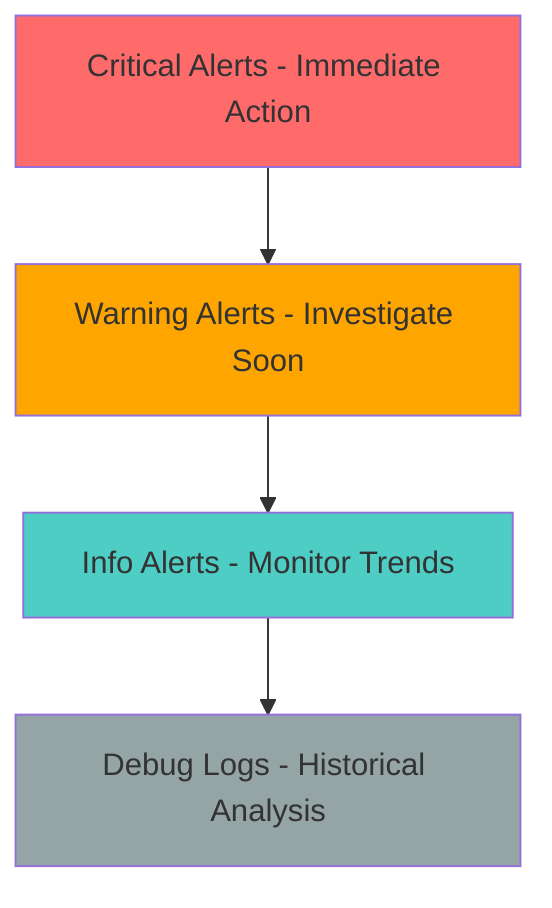

Effective alerting requires careful balance between comprehensive coverage and alert fatigue prevention. These proven practices help you build reliable, actionable alerting that improves incident response without overwhelming your team.

## Alert Strategy Fundamentals

### The Alert Quality Pyramid
Build alerting that prioritizes signal over noise:



<CardGroup cols={2}>
<Card title="Critical alerts (P1)" icon="siren">
**Immediate Action Required**
- Customer-impacting outages
- Security breaches
- Data loss scenarios
- Payment system failures
- Always page on-call engineer
</Card>

<Card title="Warning alerts (P2)" icon="triangle-alert">
**Investigate Within Hours**
- Performance degradation
- Non-critical service failures
- Approaching resource limits
- SSL certificate expiration
- Business hours response acceptable
</Card>

<Card title="Info alerts (P3)" icon="info">
**Monitor and Trend**
- Successful recoveries
- Planned maintenance
- Performance improvements
- Capacity planning data
- No immediate action needed
</Card>

<Card title="Debug data" icon="search">
**Historical Analysis**
- Detailed performance metrics
- Trace data and logs
- User behavior analytics
- System health indicators
- Available for investigation
</Card>
</CardGroup>

### Alert Criticality Matrix
Use a systematic approach to determine alert priority:

| Impact | Customer Facing | Internal Only |
|--------|----------------|---------------|
| **Complete Outage** | P1 - Page immediately | P2 - Alert within 15 min |
| **Significant Degradation** | P1 - Page immediately | P2 - Alert within 30 min |
| **Minor Issues** | P2 - Alert within 1 hour | P3 - Daily summary |
| **Performance Variance** | P3 - Monitor trends | P4 - Log only |

## Escalation Strategy Best Practices

### Run-Based vs Time-Based Escalation
Choose the right strategy for different scenarios:

<CardGroup cols={2}>
<Card title="Run-based escalation" icon="repeat">
**Best for stable systems:**
```yaml
Configuration:
  Trigger: 2-3 consecutive failures
  Use cases:
    - Reliable APIs with clear success/failure
    - Services with predictable behavior
    - Well-tested applications
    - Internal microservices
```
</Card>

<Card title="Time-based escalation" icon="clock">
**Best for dynamic systems:**
```yaml
Configuration:
  Trigger: 5-15 minutes of failures
  Use cases:
    - High-frequency checks (every 1-2 minutes)
    - Auto-scaling applications
    - Third-party dependencies
    - Rate-limited services
```
</Card>
</CardGroup>

### Frequency-Specific Configurations
Tailor escalation to check frequency:

```yaml
# High frequency (1-2 minutes)
High_Frequency_Config:
  Strategy: Time-based (10 minutes)
  Reasoning: Multiple runs provide enough signal
  Location_Threshold: 67% (avoid regional noise)
  Retries: Minimal (2 attempts, 30s apart)

# Standard frequency (5-15 minutes)  
Standard_Config:
  Strategy: Run-based (2 failures)
  Reasoning: Each run is significant
  Location_Threshold: 50% (balanced sensitivity)
  Retries: Moderate (3 attempts, exponential)

# Low frequency (30+ minutes)
Low_Frequency_Config:
  Strategy: Run-based (1 failure)
  Reasoning: Every failure is important
  Location_Threshold: 33% (high sensitivity)
  Retries: Aggressive (5 attempts, exponential)
```

## Retry Strategy Optimization

### Intelligent Retry Configuration
Match retry strategies to failure patterns:

<CardGroup cols={3}>
<Card title="Network issues" icon="wifi">
**Fixed interval retries**
```yaml
Strategy: Fixed
Interval: 10 seconds
Max_Retries: 3
Use_Case: DNS, connectivity issues
```
</Card>

<Card title="Service recovery" icon="refresh-cw">
**Linear backoff**
```yaml
Strategy: Linear
Base_Interval: 15 seconds
Max_Retries: 4
Use_Case: Service restarts, deployments
```
</Card>

<Card title="Rate limiting" icon="gauge">
**Exponential backoff**
```yaml
Strategy: Exponential
Base_Interval: 5 seconds
Max_Retries: 3
Use_Case: API rate limits, overload
```
</Card>
</CardGroup>

### Location-Based Retry Logic
Optimize retry behavior based on deployment architecture:

```yaml
# Global service (CDN, SaaS)
Global_Service_Retries:
  Same_Location: false
  Reasoning: Different location may succeed
  Locations: 6+ worldwide
  Threshold: 50% must fail

# Regional service (data center specific)
Regional_Service_Retries:
  Same_Location: true
  Reasoning: Issue likely location-specific
  Locations: 2-3 regional
  Threshold: 67% must fail

# Single location service
Single_Location_Retries:
  Same_Location: true
  Reasoning: Only one location available
  Locations: 1
  Threshold: 100% (obviously)
```

### Network vs Application Error Handling
Distinguish between network and application failures:

```yaml
Network_Retry_Configuration:
  Enabled: true
  Retry_On_Errors:
    - ECONNRESET (connection reset)
    - ENOTFOUND (DNS failure)
    - ETIMEDOUT (timeout)
    - ECONNREFUSED (connection refused)
  
  Skip_On_HTTP_Status: true
  Reasoning: "4xx/5xx are application errors, not network issues"
  
Application_Error_Handling:
  HTTP_4xx: No retry (client error)
  HTTP_5xx: No retry (server error, likely persistent)
  Assert_Failures: No retry (application logic issue)
  
Benefits:
  - Reduces noise from transient network issues
  - Focuses alerts on real application problems
  - Improves signal-to-noise ratio
```

## Channel Organization Strategies

### Multi-Tier Alert Routing
Structure alert channels for effective incident response:

```yaml
# Tier 1: Critical Production Alerts
Critical_Production:
  Checks: Customer-facing services with "critical" tag
  Escalation: Immediate on first failure
  Channels:
    - PagerDuty: Primary on-call rotation
    - SMS: Primary and backup engineers
    - Slack: #production-alerts channel
    - Phone: For P1 incidents only
  
  Business_Hours: 24/7 coverage
  Response_SLA: 5 minutes acknowledgment

# Tier 2: Standard Production Alerts  
Standard_Production:
  Checks: All production services
  Escalation: After 2 consecutive failures
  Channels:
    - Slack: #production-alerts channel
    - Email: Engineering team distribution list
    - PagerDuty: During business hours only
  
  Business_Hours: Extended hours (6 AM - 11 PM)
  Response_SLA: 30 minutes acknowledgment

# Tier 3: Non-Production Alerts
Non_Production:
  Checks: Staging, development, internal tools
  Escalation: After 3-5 consecutive failures
  Channels:
    - Slack: #dev-alerts channel
    - Email: Development team
  
  Business_Hours: Business hours only
  Response_SLA: Best effort

# Tier 4: Security and Compliance
Security_Alerts:
  Checks: SSL certificates, security scans
  Escalation: Based on days remaining/severity
  Channels:
    - Email: Security team
    - Slack: #security-alerts channel
    - SIEM: Security information system
  
  Business_Hours: 24/7 for critical, business hours for warnings
  Response_SLA: Varies by severity
```

### Team-Based Alert Distribution
Organize alerts by team responsibility:

```yaml
# Backend Services Team
Backend_Team:
  Services: ["*-api", "*-service", "database-*"]
  Channels:
    - Slack: #backend-alerts
    - Email: backend-team@company.com
    - PagerDuty: Backend on-call rotation
  
# Frontend Team  
Frontend_Team:
  Services: ["web-app", "*-ui", "cdn-*"]
  Channels:
    - Slack: #frontend-alerts
    - Email: frontend-team@company.com
    - Browser: User journey monitoring alerts
  
# Infrastructure Team
Infrastructure_Team:
  Services: ["monitoring-*", "logging-*", "metrics-*"]
  Channels:
    - Slack: #infrastructure-alerts
    - Email: devops-team@company.com
    - PagerDuty: Infrastructure on-call

# Security Team
Security_Team:
  Services: ["*ssl*", "auth-*", "security-*"]
  Channels:
    - Slack: #security-alerts
    - Email: security-team@company.com
    - SIEM: Security incident and event management
```

## Alert Fatigue Prevention

### Signal-to-Noise Optimization
Implement strategies to reduce alert fatigue:

<Steps>
<Step title="Baseline Analysis">
Monitor alert volume and response patterns for 2-4 weeks to establish baseline
</Step>

<Step title="False Positive Identification">
Track alerts that don't result in action and adjust thresholds or add retries
</Step>

<Step title="Correlation Analysis">
Identify related alerts that should be grouped or have dependencies
</Step>

<Step title="Threshold Tuning">
Gradually adjust escalation thresholds based on team response patterns
</Step>

<Step title="Regular Review">
Monthly review of alert effectiveness and team feedback
</Step>
</Steps>

### Alert Metrics and KPIs
Track alerting effectiveness with key metrics:

```yaml
# Alert Quality Metrics
Alert_Quality_KPIs:
  Signal_to_Noise_Ratio: >80% (alerts that result in action)
  False_Positive_Rate: <20% (alerts with no action needed)
  Mean_Time_to_Acknowledge: <5 minutes (critical), <30 minutes (standard)
  Mean_Time_to_Resolution: Varies by severity
  Alert_Volume_Trend: Decreasing over time (improving stability)
  
# Team Response Metrics  
Team_Response_KPIs:
  Acknowledgment_Rate: >95% (alerts acknowledged)
  Response_Time_Compliance: >90% within SLA
  Escalation_Rate: <10% (alerts requiring escalation)
  Alert_Fatigue_Score: Survey-based team feedback

# System Health Metrics
System_Health_KPIs:
  Check_Coverage: >90% of critical paths monitored
  Alert_Coverage: >95% of customer-impacting issues detected
  Recovery_Detection: >90% of recoveries properly notified
  Maintenance_Window_Compliance: >95% (proper muting)
```

### Adaptive Alerting Patterns
Implement intelligent alerting that adapts to patterns:

```yaml
# Time-Based Sensitivity
Adaptive_Sensitivity:
  Business_Hours: Standard thresholds
  After_Hours: Increased thresholds for non-critical alerts
  Weekends: Reduced sensitivity for development systems
  Holidays: Critical alerts only
  
# Load-Based Alerting
Load_Adaptive_Thresholds:
  High_Traffic_Periods: Increased response time tolerance
  Low_Traffic_Periods: Decreased tolerance (expect better performance)
  Deployment_Windows: Temporary threshold adjustments
  Maintenance_Periods: Automatic muting with exceptions

# Historical Pattern Recognition  
Pattern_Based_Alerting:
  Known_Flaky_Services: Higher retry counts and thresholds
  Seasonal_Patterns: Adjust for known traffic variations
  Deployment_Correlations: Link alerts to recent deployments
  External_Dependencies: Account for third-party service patterns
```

## Environment-Specific Strategies

### Production vs Non-Production Alerting
Tailor alerting approaches for different environments:

<CardGroup cols={2}>
<Card title="Production alerting" icon="shield">
**Maximum Reliability**
```yaml
Philosophy: "Fail fast, alert immediately"
Escalation: Aggressive (immediate for critical)
Channels: Full escalation chain
Retries: Minimal (quick detection)
Coverage: Comprehensive monitoring
Response: 24/7 on-call coverage
```
</Card>

<Card title="Non-production alerting" icon="flask">
**Balanced Noise Reduction**
```yaml
Philosophy: "Reduce noise, focus on blockers"
Escalation: Conservative (multiple failures)
Channels: Team notifications only
Retries: Aggressive (reduce false positives)
Coverage: Core functionality only
Response: Business hours support
```
</Card>
</CardGroup>

### Service Criticality Classification
Implement tiered service classification:

```yaml
# Critical Services (P1)
Critical_Services:
  Examples: ["payment-api", "user-auth", "checkout-flow"]
  Customer_Impact: Direct revenue/user impact
  Alert_Strategy: Immediate escalation
  Response_Time: <5 minutes
  Coverage: Comprehensive (API + Browser + Performance)
  
# Important Services (P2)  
Important_Services:
  Examples: ["search-api", "recommendation-engine", "analytics"]
  Customer_Impact: Degraded experience
  Alert_Strategy: 2 failure escalation
  Response_Time: <30 minutes
  Coverage: Core functionality monitoring
  
# Standard Services (P3)
Standard_Services:
  Examples: ["admin-tools", "reporting", "batch-jobs"]
  Customer_Impact: Internal operations
  Alert_Strategy: 3-5 failure escalation
  Response_Time: <2 hours
  Coverage: Basic health monitoring
  
# Development Services (P4)
Development_Services:
  Examples: ["test-environments", "staging-apis"]
  Customer_Impact: Development productivity
  Alert_Strategy: Conservative escalation
  Response_Time: Best effort
  Coverage: Minimal monitoring
```

## SSL Certificate Management

### Proactive SSL Monitoring
Implement comprehensive SSL certificate management:

```yaml
# SSL Alert Timeline
SSL_Alert_Strategy:
  90_Days_Before: Initial warning to security team
  60_Days_Before: Planning reminder + calendar entry
  30_Days_Before: Procurement/renewal initiation
  14_Days_Before: Urgent renewal warning
  7_Days_Before: Critical escalation to management
  3_Days_Before: Emergency procedures activation
  1_Day_Before: All-hands alert + communication plan
  
# SSL Monitoring Coverage
SSL_Coverage:
  Primary_Domains: All customer-facing endpoints
  Subdomain_Monitoring: Wildcard and specific subdomains
  API_Endpoints: All authenticated API services
  CDN_Certificates: Content delivery network certificates
  Internal_Services: Critical internal HTTPS services
  
# SSL Alert Channels
SSL_Alert_Routing:
  Security_Team: All SSL-related alerts
  Infrastructure_Team: Certificate deployment issues
  Engineering_Leads: Business-critical certificate alerts
  Management: Emergency escalation (3 days before expiry)
```

### SSL Alert Automation
Automate certificate renewal workflows:

```json
{
  "ssl_automation_webhook": {
    "url": "https://api.certificate-manager.com/webhook",
    "headers": {
      "Authorization": "Bearer {{CERT_MANAGER_TOKEN}}",
      "Content-Type": "application/json"
    },
    "body": {
      "domain": "{{SSL_CHECK_DOMAIN}}",
      "days_remaining": {{SSL_DAYS_REMAINING}},
      "action": "{{#lt SSL_DAYS_REMAINING 30}}initiate_renewal{{else}}{{#lt SSL_DAYS_REMAINING 7}}urgent_renewal{{else}}monitor{{/lt}}{{/lt}}",
      "priority": "{{#lt SSL_DAYS_REMAINING 7}}critical{{else}}{{#lt SSL_DAYS_REMAINING 30}}high{{else}}normal{{/lt}}{{/lt}}",
      "notification_channels": [
        "{{#lt SSL_DAYS_REMAINING 7}}pagerduty{{/lt}}",
        "slack",
        "email"
      ]
    }
  }
}
```

## Incident Response Integration

### Alert-to-Incident Workflow
Seamlessly connect alerting to incident management:

<Steps>
<Step title="Automatic Incident Creation">
Critical alerts automatically create incidents in your incident management system
</Step>

<Step title="Context Aggregation">
Related alerts are grouped into the same incident for better context
</Step>

<Step title="Escalation Integration">
Failed acknowledgments automatically escalate through on-call rotations
</Step>

<Step title="Communication Coordination">
Status page updates and customer communication triggered by alert patterns
</Step>

<Step title="Post-Incident Analysis">
Alert data feeds into post-incident reviews and improvement processes
</Step>
</Steps>

### Incident Severity Mapping
Map alert characteristics to incident severity:

```yaml
# Incident Severity Matrix
Incident_Severity_Mapping:
  SEV1_Critical:
    Triggers:
      - Customer-facing service complete outage
      - Security breach indicators
      - Data loss scenarios
      - Payment system failures
    Response: Immediate page + incident commander
    Communication: Customer notification within 15 minutes
    
  SEV2_High:
    Triggers:
      - Significant performance degradation
      - Partial service outage
      - Major feature unavailable
      - High error rates
    Response: Page during business hours, 30min after hours
    Communication: Internal teams + status page update
    
  SEV3_Medium:
    Triggers:
      - Minor performance issues
      - Non-critical feature problems
      - Infrastructure warnings
      - Approaching capacity limits
    Response: Standard team notification
    Communication: Internal teams only
    
  SEV4_Low:
    Triggers:
      - Successful recoveries
      - Planned maintenance
      - Performance improvements
      - Informational alerts
    Response: Log and monitor
    Communication: Optional team updates
```

## Maintenance and Optimization

### Regular Alert Hygiene
Maintain alerting effectiveness over time:

<Steps>
<Step title="Weekly Alert Review">
Review alert volume, false positives, and response patterns
</Step>

<Step title="Monthly Threshold Tuning">
Adjust escalation thresholds based on service behavior changes
</Step>

<Step title="Quarterly Strategy Review">
Assess overall alerting strategy effectiveness with team feedback
</Step>

<Step title="Annual Architecture Review">
Evaluate alerting architecture and integration improvements
</Step>
</Steps>

### Alert Configuration Lifecycle
Manage alert configurations as part of service lifecycle:

```yaml
# Service Onboarding
Service_Onboarding_Checklist:
  - [ ] Identify service criticality level
  - [ ] Configure basic health monitoring
  - [ ] Set up appropriate alert thresholds
  - [ ] Define escalation channels
  - [ ] Test alert delivery
  - [ ] Document alert procedures
  
# Service Updates
Service_Update_Process:
  - [ ] Review alert configuration relevance
  - [ ] Update thresholds for performance changes
  - [ ] Modify channels for team changes
  - [ ] Test configuration updates
  - [ ] Update documentation
  
# Service Decommissioning  
Service_Decommission_Process:
  - [ ] Disable alert escalation
  - [ ] Maintain monitoring for cleanup period
  - [ ] Archive alert configuration
  - [ ] Update team documentation
  - [ ] Remove from alert channels
```

### Performance and Cost Optimization
Balance comprehensive monitoring with operational efficiency:

```yaml
# Cost-Effective Monitoring
Optimization_Strategies:
  Check_Frequency: Match to business requirements, not maximum capability
  Location_Coverage: Strategic global placement, not every location
  Retry_Logic: Intelligent retries reduce check volume
  Alert_Aggregation: Group related alerts to reduce channel usage
  
# Performance Optimization
Performance_Strategies:
  Alert_Channel_Efficiency: Use webhooks for complex routing
  Batch_Processing: Aggregate notifications for high-volume alerts
  Caching: Cache alert state to prevent duplicate processing
  Rate_Limiting: Protect downstream systems from alert floods
```

## Team Training and Documentation

### Alerting Runbooks
Create comprehensive alert response documentation:

```yaml
# Alert Runbook Template
Alert_Runbook_Structure:
  Alert_Description: What the alert means
  Severity_Level: P1/P2/P3 classification
  Initial_Response: First steps to take
  Investigation_Steps: How to diagnose the issue
  Escalation_Path: When and how to escalate
  Resolution_Steps: Common fixes and procedures
  Prevention: How to prevent recurrence
  
# Example: Payment API Failure Runbook
Payment_API_Failure_Runbook:
  Description: "Payment processing API is failing or unavailable"
  Severity: P1 (Critical - Revenue Impact)
  Initial_Response:
    - Acknowledge alert within 5 minutes
    - Check payment provider status pages
    - Verify database connectivity
    - Review recent deployments
  Investigation:
    - Check error rates in monitoring dashboard
    - Review application logs for error patterns
    - Verify third-party payment processor status
    - Check network connectivity to payment services
  Escalation:
    - If no resolution in 15 minutes, escalate to engineering manager
    - If payment processor issue, escalate to business team
    - If database issue, escalate to DBA team
```

### Team Alert Training
Ensure team readiness for effective alert response:

<Steps>
<Step title="Alert Response Training">
Regular training on alert acknowledgment, investigation, and escalation procedures
</Step>

<Step title="Runbook Maintenance">
Keep alert runbooks current with service changes and lessons learned
</Step>

<Step title="Simulation Exercises">
Practice incident response with simulated alerts and scenarios
</Step>

<Step title="Tool Familiarity">
Ensure team knows how to use monitoring tools, alert channels, and escalation systems
</Step>

<Step title="Continuous Improvement">
Regular retrospectives on alert effectiveness and response procedures
</Step>
</Steps>

<Note>
Effective alerting is as much about people and processes as it is about technology. Focus on creating sustainable practices that improve over time rather than perfect configurations from day one.
</Note>

<Warning>
Alert fatigue is a serious risk to incident response effectiveness. Prioritize signal quality over alert quantity, and regularly review and tune your alerting to maintain team confidence in the system.
</Warning>

<Tip>
Start with conservative alerting and gradually increase sensitivity as your team builds confidence and processes mature. It's better to miss a few edge cases initially than to overwhelm your team with false positives.
</Tip>