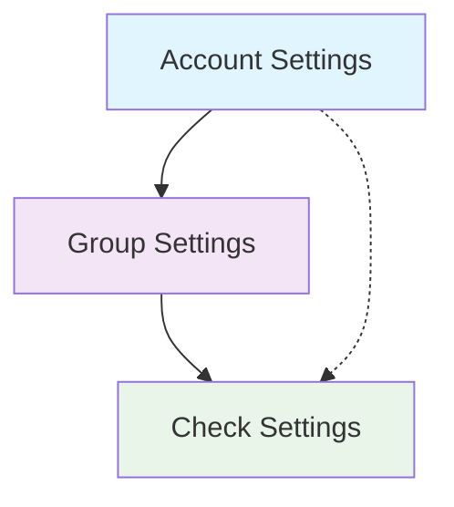

Alert configuration controls **when** and **how often** you receive notifications when checks fail, degrade, or recover. Proper configuration minimizes alert fatigue while ensuring critical issues receive immediate attention.

## Alert Configuration Hierarchy

Checkly provides a three-tier configuration system that allows for flexible alert management across your organization:

### Account Level
**Default Settings**
- Organization-wide defaults
- Applied to all checks unless overridden
- Simplifies management at scale
- Consistent baseline behavior

### Group Level
**Team-Specific Settings**
- Override account defaults for check groups
- Team-based alert preferences
- Service-specific requirements
- Departmental escalation policies

### Check Level
**Individual Overrides**
- Fine-tune specific check behavior
- Handle special requirements
- Debug and testing scenarios
- Legacy system accommodations

### Configuration Inheritance
Understanding how settings cascade through the hierarchy:



**Inheritance Rules:**
1. **Check-level settings** always take highest precedence
2. **Group-level settings** override account defaults for member checks
3. **Account-level settings** provide the baseline for all other configurations
4. **Explicit overrides** can be enabled/disabled at group level

## Account-Level Alert Configuration

### Default Alert Settings
Configure organization-wide defaults that apply to all checks:


```yaml
# Example account-level configuration
Account Alert Settings:
  Escalation Strategy: Run-based (2 consecutive failures)
  Reminder Schedule:
    - First reminder: 5 minutes after alert
    - Second reminder: 15 minutes after first
    - Maximum reminders: 2
  
  Location Threshold: 50% of locations must fail
  
  Default Channels:
    - Email: ops-team@company.com
    - Slack: #monitoring-alerts
  
  SSL Certificate Alerts:
    - Warning: 30 days before expiration
    - Critical: 7 days before expiration
```

### Account Settings Benefits
- **Consistency**: Uniform alerting behavior across all monitoring
- **Efficiency**: Configure once, apply everywhere
- **Compliance**: Meet organizational alerting requirements
- **Scalability**: Easy to manage large numbers of checks

## Group-Level Alert Configuration

### Group-Specific Overrides
Configure alerts for teams and service categories:


```yaml
# Production API Services Group
Group: "Production APIs"
Alert Settings:
  Escalation Strategy: Time-based (5 minutes of failures)
  Reminder Schedule:
    - First reminder: 2 minutes
    - Second reminder: 5 minutes
    - Third reminder: 10 minutes
  
  Location Threshold: 67% (more sensitive)
  
  Override Channels:
    - PagerDuty: Production escalation policy
    - Slack: #production-alerts
    - SMS: On-call engineer
  
  Mute During: Maintenance windows
  Priority: Critical

---

# Development Environment Group  
Group: "Development Checks"
Alert Settings:
  Escalation Strategy: Run-based (5 consecutive failures)
  Reminder Schedule: None
  
  Location Threshold: 100% (single location)
  
  Override Channels:
    - Email: dev-team@company.com
    - Slack: #dev-alerts
  
  Business Hours Only: true
  Priority: Low
```

### Group Override Strategies
Configure how group settings interact with individual checks:

#### Group settings override individual check settings
**Enforced Group Policy**
- Group settings take precedence
- Ensures consistency within teams
- Prevents individual check drift
- Simplifies management

#### Individual check settings take precedence
**Flexible Individual Control**
- Check-level customization allowed
- Handle special cases easily
- Legacy system accommodation
- Granular control when needed

## Check-Level Alert Configuration

### Individual Check Overrides
Fine-tune alerting for specific checks with unique requirements:


```yaml
# Critical Payment API
Check: "Payment Gateway Health"
Alert Settings:
  Escalation Strategy: Immediate (first failure)
  Reminder Schedule:
    - First reminder: 1 minute
    - Second reminder: 3 minutes
    - Escalate to manager: 5 minutes
  
  Location Threshold: 33% (very sensitive)
  
  Custom Channels:
    - PagerDuty: Payment team escalation
    - SMS: Primary and backup engineers
    - Webhook: Internal incident system
  
  Tags: ["critical", "payment", "p1"]
  Never Mute: true

---

# Internal Dashboard Check
Check: "Admin Dashboard Monitoring"  
Alert Settings:
  Escalation Strategy: Run-based (10 consecutive failures)
  Reminder Schedule: None
  
  Location Threshold: 100%
  
  Minimal Channels:
    - Email: admin-team@company.com
  
  Mute Enabled: true (for maintenance)
  Business Hours Only: true
```

### Special Configuration Scenarios

#### Debug and Testing Configurations
```yaml
# Temporary debugging setup
Debug Check Configuration:
  Escalation Strategy: Disabled
  Channels: Developer email only
  Mute: Enabled by default
  Temporary: 24-hour auto-revert
```

#### Legacy System Accommodations
```yaml
# Accommodating known flaky systems
Legacy System Configuration:
  Escalation Strategy: Run-based (10 failures)
  Retry Strategy: Exponential with high tolerance
  Channels: Maintenance team only
  Expected Downtime: Documented patterns
```

## Escalation Strategies

### Run-Based Escalation
Alert after a specific number of consecutive failures:

#### How it works
**Consecutive Failure Counting**
- Counts failed check runs in sequence
- Resets counter on successful run
- Cross-location failures count as one run
- Retries don't count as separate runs

#### Best for
**Stable Systems**
- Predictable failure patterns
- Clear success/failure states  
- Services with known reliability
- APIs with consistent behavior

```yaml
# Example: Alert after 2 consecutive failures
Run-Based Configuration:
  Trigger: 2 consecutive failures
  
Scenario:
  15:00 - Check fails in Frankfurt and Tokyo (Run 1)
  15:05 - Check fails again from both locations (Run 2) → ALERT SENT
  15:10 - Check succeeds → Counter resets
```


### Time-Based Escalation
Alert when checks fail continuously for a specific duration:

#### How it works
**Duration-Based Triggering**
- Monitors failure duration, not count
- Ideal for high-frequency checks
- Ignores individual run results
- Focuses on sustained problems

#### Best for
**High-Frequency Monitoring**
- Checks running every 1-5 minutes
- Services with intermittent issues
- Rate-limited APIs
- Network-dependent services

```yaml
# Example: Alert after 10 minutes of failures
Time-Based Configuration:
  Trigger: 10 minutes of continuous failures
  
Scenario:
  15:00 - Check starts failing (Timer starts)
  15:01-15:09 - Continued failures (Timer continues)
  15:10 - Still failing → ALERT SENT
  15:11 - Check recovers → Timer resets
```


### Location Threshold Filtering
Reduce noise from regional outages by requiring multiple location failures:

```yaml
Location Threshold Configuration:
  Total Locations: 6 worldwide
  Threshold: 50% must fail
  Result: Alert only when 3+ locations fail simultaneously
  
Benefits:
  - Reduces false positives from regional issues
  - Focuses on global service problems
  - Accommodates CDN and geo-distributed services
  - Filters out single-location network problems
```


**Location Threshold Examples:**

#### Conservative (67%)
```yaml
Use Case: Critical global services
Locations: 6
Threshold: 67% (4 locations)
Triggers: Major outages only
```

#### Balanced (50%)
```yaml
Use Case: Standard web services
Locations: 4  
Threshold: 50% (2 locations)
Triggers: Significant issues
```

#### Sensitive (33%)
```yaml
Use Case: Regional services
Locations: 3
Threshold: 33% (1 location)
Triggers: Any location failure
```

## Reminder Configuration

### Reminder Strategies
Configure follow-up notifications for unresolved incidents:

```yaml
# Aggressive reminder schedule (critical systems)
Critical System Reminders:
  First Reminder: 2 minutes after initial alert
  Second Reminder: 5 minutes after first reminder
  Third Reminder: 10 minutes after second reminder
  Maximum Reminders: 3
  Escalation: Manager notification after 3rd reminder

# Standard reminder schedule (normal operations)
Standard Reminders:
  First Reminder: 5 minutes after initial alert
  Second Reminder: 15 minutes after first reminder
  Maximum Reminders: 2
  Auto-Cancel: On check recovery

# Minimal reminders (development systems)
Development Reminders:
  First Reminder: 30 minutes after initial alert
  Maximum Reminders: 1
  Business Hours Only: true
```

### Smart Reminder Management
Checkly automatically manages reminder lifecycle:

<Steps>
<Step title="Initial Alert Sent">
Primary alert sent to configured channels when escalation threshold is met
</Step>

<Step title="Reminder Timer Starts">
Reminder countdown begins based on configuration
</Step>

<Step title="Reminder Notifications">
Follow-up alerts sent at configured intervals
</Step>

<Step title="Automatic Cancellation">
All pending reminders cancelled when check recovers
</Step>

<Step title="Escalation Handling">
Optional escalation to different teams/channels after maximum reminders
</Step>
</Steps>

## Retry Configuration and Strategies

### Retry Strategy Overview
Intelligent retry mechanisms reduce false positives and alert noise:

#### Fixed Interval
**Consistent Timing**
- Same delay between retries
- Predictable retry pattern
- Simple configuration
- Good for stable networks

#### Linear Backoff
**Gradual Increase**
- Linearly increasing delays
- Allows services time to recover
- Balances speed and patience
- Good for overloaded services

#### Exponential Backoff
**Rapid Increase**
- Exponentially increasing delays
- Avoids overwhelming services
- Industry standard approach
- Good for rate-limited APIs

### Fixed Interval Retries
Consistent retry timing for predictable failure patterns:

```typescript
// Fixed retry configuration
const fixedRetryConfig = {
  strategy: "fixed",
  maxRetries: 3,
  intervalSeconds: 10,        // 10s, 10s, 10s
  maxDurationSeconds: 60,     // Maximum 1 minute total
  sameLocation: false         // Try different locations
}

// Use cases:
// - Network connectivity issues
// - DNS resolution problems  
// - Simple service restarts
// - Known intermittent failures
```

### Linear Backoff Retries
Gradually increasing intervals for services that need recovery time:

```typescript
// Linear retry configuration
const linearRetryConfig = {
  strategy: "linear", 
  maxRetries: 4,
  baseIntervalSeconds: 5,     // 5s, 10s, 15s, 20s
  maxDurationSeconds: 120,    // Maximum 2 minutes total
  sameLocation: true          // Same location retry
}

// Use cases:
// - Database connection recovery
// - Service warm-up periods
// - Cache rebuilding scenarios
// - Gradual service restoration
```

### Exponential Backoff Retries
Rapidly increasing intervals for rate-limited or overloaded services:

```typescript
// Exponential retry configuration  
const exponentialRetryConfig = {
  strategy: "exponential",
  maxRetries: 3,
  baseIntervalSeconds: 5,     // 5s, 25s, 125s (2m 5s)
  maxDurationSeconds: 180,    // Maximum 3 minutes total
  sameLocation: false         // Different location retry
}

// Use cases:
// - Rate-limited APIs
// - Overloaded services
// - Third-party service dependencies
// - Auto-scaling scenarios
```

### Location-Based Retry Logic
Configure retry behavior based on geographic distribution:

#### Same Location Retry
**When to Use:**
- Investigating location-specific issues
- Network routing problems
- Regional infrastructure problems
- ISP connectivity issues

**Configuration:**
```yaml
sameLocation: true
useCase: "Diagnose regional problems"
```

#### Different Location Retry
**When to Use:**
- Validating global service availability
- Bypassing regional outages  
- Load balancer health checks
- CDN failover testing

**Configuration:**
```yaml
sameLocation: false
useCase: "Ensure global availability"
```

### Network-Specific Retries
Automatic retries for network-related failures only:

```typescript
// Network retry configuration
const networkRetryConfig = {
  enabled: true,
  retryOnErrors: [
    "ECONNRESET",     // Connection reset
    "ENOTFOUND",      // DNS resolution failed
    "ETIMEDOUT",      // Connection timeout
    "EAI_AGAIN",      // Temporary DNS failure
    "ECONNREFUSED"    // Connection refused
  ],
  skipOnHttpStatus: true,  // Don't retry 4xx/5xx responses
  maxRetries: 2,
  intervalSeconds: 5
}

// Benefits:
// - Reduces noise from network glitches
// - Doesn't mask application errors
// - Improves signal-to-noise ratio
// - Focuses on real service issues
```

## SSL Certificate Alert Configuration

### SSL Monitoring Setup
Proactive SSL certificate expiration monitoring:

```yaml
SSL Alert Configuration:
  Default Warning: 30 days before expiration
  Critical Warning: 7 days before expiration
  Emergency Warning: 1 day before expiration
  
Alert Channels:
  30 Days: Email to security team
  7 Days: Email + Slack + SIEM integration
  1 Day: PagerDuty + SMS + Email + Slack
  
Check Frequency: Daily at 2 AM UTC
Coverage: All HTTPS checks automatically monitored
```

### SSL Alert Variables
Customize SSL alerts with specific certificate information:

```json
{
  "alert_type": "ssl_expiration",
  "certificate": {
    "domain": "{{SSL_CHECK_DOMAIN}}",
    "days_remaining": {{SSL_DAYS_REMAINING}},
    "expires_at": "{{SSL_EXPIRY_DATE}}",
    "issuer": "{{SSL_ISSUER}}",
    "subject": "{{SSL_SUBJECT}}"
  },
  "priority": "{{#lt SSL_DAYS_REMAINING 7}}critical{{else}}{{#lt SSL_DAYS_REMAINING 30}}warning{{else}}info{{/lt}}{{/lt}}",
  "action_required": {{#lt SSL_DAYS_REMAINING 14}}true{{else}}false{{/lt}},
  "check_details": {
    "check_id": "{{CHECK_ID}}",
    "check_name": "{{CHECK_NAME}}",
    "result_link": "{{RESULT_LINK}}"
  }
}
```

## Muting and Temporary Controls

### Alert Muting
Temporarily disable alerts without stopping checks:

#### Maintenance muting
**Planned Maintenance**
- Schedule muting for known downtime
- Automatic unmuting after maintenance
- Maintenance window integration
- Team notification of muted state

#### Troubleshooting muting
**Active Investigation**
- Mute noisy alerts during debugging
- Prevent alert fatigue during incidents
- Manual unmuting when resolved
- Audit trail of muting actions

```yaml
# Muting configuration options
Muting Options:
  Manual Mute: Toggle alerts on/off instantly
  Scheduled Mute: Plan maintenance windows
  Auto-Unmute: Automatic restoration
  Mute Inheritance: Group-level muting affects all checks
  
Mute Indicators:
  Dashboard: Visual mute status
  API: Programmatic mute control
  Notifications: Mute state changes
  Audit Log: Track muting history
```

### Maintenance Window Integration
Coordinate muting with planned maintenance:

```yaml
Maintenance Window Setup:
  Schedule: Weekly Sunday 2-4 AM UTC
  Auto-Mute: All production checks
  Notifications: 
    - Pre-maintenance: Team notification
    - During: Muted status visible
    - Post-maintenance: Auto-unmute + summary
  
Emergency Override: Critical checks can break through muting
```

## Advanced Configuration Patterns

### Environment-Specific Configuration
Tailor alerting for different deployment environments:

```yaml
Production Environment:
  Escalation: Immediate for P1 checks
  Channels: PagerDuty + SMS + Slack
  Retries: Minimal (fast detection)
  Location Threshold: 50%
  Business Hours: 24/7 coverage

Staging Environment:
  Escalation: After 2 failures
  Channels: Slack + Email
  Retries: Moderate (balance detection/noise)
  Location Threshold: 67%
  Business Hours: Business hours only

Development Environment:
  Escalation: After 5 failures
  Channels: Email only
  Retries: Aggressive (minimize noise)
  Location Threshold: 100%
  Business Hours: Developer hours only
```

### Service-Based Configuration Profiles
Create reusable configuration templates:

```yaml
# Critical Payment Services Profile
Profile: "payment-critical"
Escalation: Immediate
Channels: [PagerDuty, SMS, Slack-critical]
Retries: Fixed (2 retries, 5s interval)
Location Threshold: 33%
Tags: ["p1", "payment", "critical"]

# Standard API Services Profile  
Profile: "api-standard"
Escalation: Run-based (2 failures)
Channels: [Slack-alerts, Email-team]
Retries: Exponential (3 retries, 5s base)
Location Threshold: 50%
Tags: ["api", "standard"]

# Background Job Profile
Profile: "background-jobs"
Escalation: Time-based (30 minutes)
Channels: [Email-team]
Retries: Linear (5 retries, 10s base)
Location Threshold: 100%
Tags: ["background", "batch"]
```

### Conditional Alert Configuration
Dynamic alerting based on check properties and external factors:

```yaml
Conditional Alerting Rules:
  Time-Based:
    - Business Hours: Standard escalation
    - After Hours: Critical escalation only
    - Weekends: Reduced sensitivity
    
  Tag-Based:
    - "critical": Immediate escalation
    - "performance": Degradation alerts only
    - "security": Separate security team channel
    
  Location-Based:
    - Single location: More aggressive retries
    - Multi-location: Location threshold filtering
    - Global deployment: Regional backup alerting
```

## Configuration Testing and Validation

### Alert Configuration Testing
Verify your alerting setup works correctly:

<Steps>
<Step title="Test Alert Delivery">
Use Checkly's test alert feature to verify channel delivery
</Step>

<Step title="Validate Escalation Timing">
Confirm escalation triggers at expected thresholds
</Step>

<Step title="Verify Reminder Schedules">
Test reminder delivery and cancellation behavior
</Step>

<Step title="Check Muting Functionality">
Ensure muting properly stops alerts without affecting checks
</Step>

<Step title="Test Recovery Notifications">
Validate that recovery alerts are sent appropriately
</Step>
</Steps>

### Configuration Monitoring
Track the effectiveness of your alert configuration:

```yaml
Alert Configuration Metrics:
  Alert Volume: Track daily/weekly alert counts
  False Positive Rate: Measure alerts without action needed
  Response Time: Time from alert to acknowledgment
  Channel Success Rate: Delivery success per channel
  Escalation Effectiveness: Percentage reaching on-call team
  
Regular Reviews:
  Weekly: Alert volume and patterns
  Monthly: Configuration adjustments
  Quarterly: Strategy effectiveness review
  Annual: Complete alerting strategy assessment
```

<Note>
Start with conservative alert settings and gradually tune based on your team's response patterns and service reliability characteristics. Too many alerts can be worse than too few.
</Note>

<Warning>
Always test your alert configuration changes in non-production environments first. Failed alert delivery during an actual incident can significantly impact response time.
</Warning>

<Tip>
Use Checkly's alert notification log to analyze delivery patterns and identify optimization opportunities. Look for channels with high failure rates or excessive alert volume.
</Tip>