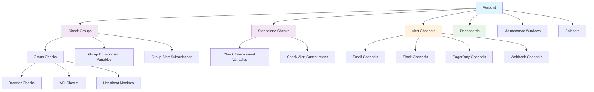

import { Note, Warning, Tip, Steps, Step, CardGroup, Card, Tabs, Tab, CodeGroup, Callout } from 'mintlify/components'

The Checkly Terraform provider enables you to manage your entire monitoring infrastructure as code using [HashiCorp Terraform](https://www.terraform.io/). This comprehensive guide covers everything you need to know about implementing monitoring as code with Checkly.

<Callout type="info" emoji="=€">
Transform your monitoring setup into version-controlled, reproducible infrastructure that scales with your applications and follows DevOps best practices.
</Callout>

## Why Monitoring as Code?

<CardGroup cols={2}>
<Card title="Version Control" icon="git-branch">
**Track Every Change**
- Git history for all monitoring changes
- Code review processes for monitoring
- Rollback capabilities for configurations
- Collaborative monitoring development
</Card>

<Card title="Automation" icon="robot">
**DevOps Integration**
- Automated monitoring deployments
- CI/CD pipeline integration
- Environment parity enforcement
- Consistent configurations across stages
</Card>

<Card title="Scalability" icon="expand">
**Efficient Management**
- Manage hundreds of checks efficiently
- Parameterized resource creation
- Bulk updates and modifications
- Consistent tagging and organization
</Card>

<Card title="Reliability" icon="shield-check">
**Production Ready**
- Infrastructure as Code best practices
- Immutable monitoring configurations
- Disaster recovery capabilities
- Reduced manual configuration errors
</Card>
</CardGroup>

## Getting Started

<Steps>
<Step title="Install Terraform">
Download and install [Terraform CLI](https://www.terraform.io/downloads) (version 0.13 or later)
</Step>

<Step title="Configure Provider">
Set up the Checkly provider in your Terraform configuration
</Step>

<Step title="Authenticate">
Configure your Checkly API credentials as environment variables
</Step>

<Step title="Create Resources">
Define your monitoring infrastructure using Terraform resources
</Step>

<Step title="Deploy">
Apply your configuration to create monitoring checks in Checkly
</Step>
</Steps>

## Core Concepts

### Resource Types

The Checkly Terraform provider supports comprehensive monitoring resource management:

<CardGroup cols={3}>
<Card title="Checks" icon="check-circle">
**Monitoring Tests**
- Browser checks (Playwright)
- API checks (HTTP/REST)
- Heartbeat monitors
- TCP port monitoring
- Multistep workflows
</Card>

<Card title="Groups" icon="layer-group">
**Organization**
- Check grouping and organization
- Shared configurations
- Bulk operations
- Environment separation
</Card>

<Card title="Alerting" icon="bell">
**Notifications**
- Alert channels (email, Slack, PagerDuty)
- Alert settings and escalation
- Channel subscriptions
- Notification preferences
</Card>

<Card title="Dashboards" icon="chart-line">
**Visibility**
- Public status pages
- Custom branding
- Real-time monitoring displays
- Stakeholder communication
</Card>

<Card title="Maintenance" icon="wrench">
**Operations**
- Scheduled maintenance windows
- Planned downtime management
- Alert suppression
- Recurring schedules
</Card>

<Card title="Automation" icon="zap">
**Integration**
- CI/CD triggers
- Command-line execution
- Programmatic control
- Pipeline integration
</Card>
</CardGroup>

### Configuration Patterns

<Tabs>
<Tab title="Basic Setup">
```terraform
terraform {
  required_providers {
    checkly = {
      source  = "checkly/checkly"
      version = "~> 1.0"
    }
  }
}

variable "checkly_api_key" {}
variable "checkly_account_id" {}

provider "checkly" {
  api_key    = var.checkly_api_key
  account_id = var.checkly_account_id
}
```
</Tab>

<Tab title="Environment Variables">
```bash
# Set your credentials
export TF_VAR_checkly_api_key="cu_your_api_key_here"
export TF_VAR_checkly_account_id="your_account_id_here"

# Initialize and apply
terraform init
terraform plan
terraform apply
```
</Tab>
</Tabs>

## Essential Resources

### Browser Checks

Monitor user journeys and application workflows using Playwright automation.

<Tabs>
<Tab title="Browser Check">
```terraform
resource "checkly_check" "user_login" {
  name      = "User Login Flow"
  type      = "BROWSER"
  activated = true
  frequency = 5

  locations = [
    "us-west-1",
    "eu-central-1"
  ]

  script = file("${path.module}/scripts/login.spec.js")
  
  tags = ["authentication", "critical"]
}
```
</Tab>
</Tabs>

### API Checks

Validate API endpoints, response times, and data integrity.

<Tabs>
<Tab title="API Check">
```terraform
resource "checkly_check" "api_health" {
  name      = "API Health Check"
  type      = "API"
  activated = true
  frequency = 1

  locations = ["us-west-1", "eu-central-1"]

  request {
    url = "https://api.example.com/health"
    
    assertion {
      source     = "STATUS_CODE"
      comparison = "EQUALS"
      target     = "200"
    }
    
    assertion {
      source     = "RESPONSE_TIME"
      comparison = "LESS_THAN"
      target     = "2000"
    }
  }
  
  tags = ["api", "health"]
}
```
</Tab>
</Tabs>

### Check Groups

Organize related checks and apply shared configurations.

<Tabs>
<Tab title="Check Group">
```terraform
resource "checkly_check_group" "api_monitoring" {
  name      = "API Monitoring Suite"
  activated = true

  locations = [
    "us-west-1",
    "eu-central-1",
    "ap-southeast-1"
  ]

  concurrency = 10
  
  environment_variables = {
    API_BASE_URL = "https://api.example.com"
    TIMEOUT_MS   = "5000"
  }
  
  tags = ["api", "production"]
}
```
</Tab>
</Tabs>

### Alert Channels

Configure notification channels for monitoring alerts.

<Tabs>
<Tab title="Email & Slack Alerts">
```terraform
# Email notifications
resource "checkly_alert_channel" "email_alerts" {
  email {
    address = "devops@example.com"
  }
  send_recovery = true
  send_failure  = true
  send_degraded = false
}

# Slack notifications
resource "checkly_alert_channel" "slack_alerts" {
  slack {
    url     = var.slack_webhook_url
    channel = "#monitoring"
  }
  send_recovery = true
  send_failure  = true
}

# Subscribe checks to alerts
resource "checkly_check" "critical_api" {
  name = "Critical API"
  type = "API"
  
  alert_channel_subscription {
    channel_id = checkly_alert_channel.email_alerts.id
    activated  = true
  }
  
  alert_channel_subscription {
    channel_id = checkly_alert_channel.slack_alerts.id
    activated  = true
  }
  
  # ... check configuration
}
```
</Tab>
</Tabs>

## Advanced Features

### Parameterized Resources

Create scalable configurations using Terraform's native constructs.

<Tabs>
<Tab title="Dynamic Resources">
```terraform
# Define services to monitor
locals {
  services = {
    user_service = {
      endpoint = "/users"
      frequency = 1
      critical = true
    }
    order_service = {
      endpoint = "/orders"
      frequency = 2
      critical = true
    }
    analytics_service = {
      endpoint = "/analytics"
      frequency = 5
      critical = false
    }
  }
}

# Create checks for each service
resource "checkly_check" "service_monitors" {
  for_each = local.services

  name      = "${title(replace(each.key, "_", " "))} Health"
  type      = "API"
  activated = true
  frequency = each.value.frequency

  locations = each.value.critical ? [
    "us-west-1", "eu-central-1", "ap-southeast-1"
  ] : ["us-west-1"]

  request {
    url = "https://api.example.com${each.value.endpoint}"
    assertion {
      source     = "STATUS_CODE"
      comparison = "EQUALS"
      target     = "200"
    }
  }
  
  tags = [
    "api",
    each.key,
    each.value.critical ? "critical" : "standard"
  ]
}
```
</Tab>
</Tabs>

### Code Snippets and Variables

Share reusable code and configuration across checks.

<Tabs>
<Tab title="Reusable Code">
```terraform
# Shared authentication helper
resource "checkly_snippet" "auth_helpers" {
  name   = "AuthHelpers"
  script = file("${path.module}/snippets/auth-helpers.js")
}

# Environment-specific configuration
resource "checkly_check_group" "e2e_tests" {
  name = "E2E Test Suite"
  
  environment_variables = {
    API_BASE_URL  = var.environment == "production" ? 
                    "https://api.example.com" : 
                    "https://staging-api.example.com"
    TEST_EMAIL    = "test@example.com"
    TEST_PASSWORD = var.test_password
  }
  
  locations = ["us-west-1", "eu-central-1"]
  tags = [var.environment, "e2e"]
}
```
</Tab>
</Tabs>

## CI/CD Integration

### GitHub Actions Example

<Tabs>
<Tab title="GitHub Workflow">
```yaml
name: Deploy Monitoring

on:
  push:
    branches: [ main ]
    paths: [ 'terraform/**' ]

env:
  TF_VAR_checkly_api_key: ${{ secrets.CHECKLY_API_KEY }}
  TF_VAR_checkly_account_id: ${{ secrets.CHECKLY_ACCOUNT_ID }}

jobs:
  deploy:
    runs-on: ubuntu-latest
    
    steps:
    - uses: actions/checkout@v3
    
    - name: Setup Terraform
      uses: hashicorp/setup-terraform@v2
      
    - name: Terraform Init
      run: terraform init
      working-directory: ./terraform
      
    - name: Terraform Plan
      run: terraform plan -no-color
      working-directory: ./terraform
      
    - name: Terraform Apply
      run: terraform apply -auto-approve
      working-directory: ./terraform
```
</Tab>
</Tabs>

## Best Practices

<CardGroup cols={2}>
<Card title="Code Organization" icon="folder">
**Structure Your Code**
- Separate environments with workspaces
- Use modules for reusable components
- Organize resources logically
- Follow naming conventions
</Card>

<Card title="Security" icon="shield-check">
**Secure Configurations**
- Store API keys as secrets
- Use environment variables
- Implement least-privilege access
- Audit configuration changes
</Card>

<Card title="Scalability" icon="expand">
**Design for Growth**
- Use parameterized resources
- Implement efficient tagging
- Plan for multiple environments
- Consider resource limits
</Card>

<Card title="Maintainability" icon="wrench">
**Long-term Success**
- Document your configurations
- Implement code review processes
- Use version control effectively
- Regular configuration audits
</Card>
</CardGroup>

## Resource Hierarchy

Understanding how Checkly resources relate to each other:



## Getting Help

<Note>
The Checkly Terraform provider is actively maintained and supported. For issues or questions:

- **Documentation**: Complete guides and examples in this documentation
- **GitHub Issues**: [Report bugs or request features](https://github.com/checkly/terraform-provider-checkly/issues)
- **Community**: Join discussions in our community forums
- **Support**: Contact Checkly support via the in-app chat widget
</Note>

## Next Steps

Ready to implement monitoring as code? Choose your path:

<CardGroup cols={2}>
<Card title="Quick Start" icon="rocket" href="/docs/integrations/terraform/">
Get up and running with basic monitoring setup in minutes
</Card>

<Card title="Check Types" icon="check-circle" href="/docs/integrations/terraform/checks-groups">
Learn about different check types and how to configure them
</Card>

<Card title="Alerting Setup" icon="bell" href="/docs/integrations/terraform/alerting">
Configure comprehensive alerting and notification channels
</Card>

<Card title="CI/CD Integration" icon="git-merge" href="/docs/integrations/terraform/ci-cd">
Integrate monitoring deployment with your development workflow
</Card>
</CardGroup>

## Additional Resources

- [Official Terraform Registry Documentation](https://registry.terraform.io/providers/checkly/checkly/latest/docs)
- [Checkly Terraform Provider on GitHub](https://github.com/checkly/terraform-provider-checkly)
- [Getting Started Sample Repository](https://github.com/checkly/checkly-terraform-getting-started)
- [HashiCorp Terraform Documentation](https://developer.hashicorp.com/terraform/docs)