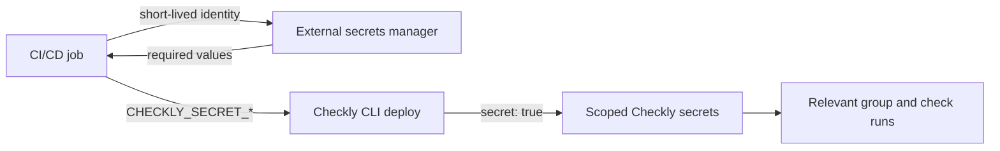

Use an external secrets manager as the source of truth when you manage many credentials with Monitoring as Code. Load the values into the deployment environment, then deploy each secret at the narrowest Checkly scope that needs it.

This prevents every check execution from receiving a large account-wide secret set while keeping secret values out of your repository and CI/CD configuration.

<Accordion title="Prerequisites">
  - A Checkly Monitoring as Code project using a current version of the Checkly CLI.
  - A secrets manager that your CI/CD workload can authenticate to.
  - Permission to deploy the checks and groups that will use the secrets.
  - Runtime `2024.09` or later. Private Locations require agent `3.3.4` or later.
</Accordion>

## Understand the names in these examples

| Name | Meaning |
| --- | --- |
| `CHECKLY_API_KEY` | Required secret credential used by the Checkly CLI. Supply an API key for your Checkly account. |
| `CHECKLY_ACCOUNT_ID` | Required identifier for the Checkly account the CLI deploys to. This value is not secret. |
| `CHECKLY_SECRET_<NAME>` | Deployment environment variable read by `secret('<NAME>')`. You define `<NAME>` for each secret in your project. |
| `PAYMENTS_API_KEY`, `PAYMENTS_ADMIN_TOKEN`, `payments-api-key`, and `payments.example.com` | Fictional application values used only to demonstrate group and check scoping. Replace them with the credentials, names, and URLs used by the service you monitor. |

`PAYMENTS_API_KEY` and `PAYMENTS_ADMIN_TOKEN` are not built-in Checkly variables and are not required by any secrets manager.

## How the deployment works



The secret value exists in the deployment process long enough for the Checkly CLI to synthesize and deploy the construct. Checkly then encrypts it and stores it at the configured group or check scope.

<Warning>
  `secret()` is a deployment-time environment lookup, not a persistent reference to your external secrets manager. Rotating a value in the external manager does not update Checkly until you deploy again.
</Warning>

## Choose the narrowest scope

Checkly [merges variables when a check runs](/platform/variables#variable-hierarchy). Check-level values override group-level values, which override account-level values.

| Scope | Use it for |
| --- | --- |
| Account | Values genuinely needed by almost every check in the account. |
| Group | Credentials shared by one service, application, environment, or team. |
| Check | Credentials used by one check only. |

Each check or group can define up to 100 environment variables. If one deployment project spans many teams or systems, consider splitting it into independently deployed projects so each deployment identity can access only its own secrets.

## Read secrets during deployment

The `secret()` helper reads `CHECKLY_SECRET_<NAME>` from the environment and stops with an error when the value is missing. For example, `secret('PAYMENTS_API_KEY')` reads `CHECKLY_SECRET_PAYMENTS_API_KEY`.

```typescript secrets.ts
import { secret } from 'checkly/util'

export const PAYMENTS_API_KEY = secret('PAYMENTS_API_KEY')
export const PAYMENTS_ADMIN_TOKEN = secret('PAYMENTS_ADMIN_TOKEN')
```

Your external secrets manager can use different names. Map its identifiers to the `CHECKLY_SECRET_*` names expected by the project when you fetch the values in CI/CD.

Every CLI command that loads these constructs needs the corresponding environment values, including `checkly test` and `checkly deploy`. Never provide production secrets to pull request workflows that run untrusted code.

## Deploy a group-level secret

```typescript __checks__/payments-group.check.ts
import { ApiCheck, CheckGroupV2, Frequency } from 'checkly/constructs'
import { PAYMENTS_API_KEY } from '../secrets'

const paymentsGroup = new CheckGroupV2('payments', {
  name: 'Payments',
  activated: true,
  muted: false,
  frequency: Frequency.EVERY_10M,
  locations: ['us-east-1'],
  environmentVariables: [
    {
      key: 'PAYMENTS_API_KEY',
      value: PAYMENTS_API_KEY,
      secret: true,
    },
  ],
})

new ApiCheck('payments-health', {
  name: 'Payments health',
  group: paymentsGroup,
  request: {
    method: 'GET',
    url: 'https://payments.example.com/health',
    headers: [{ key: 'Authorization', value: 'Bearer {{PAYMENTS_API_KEY}}' }],
  },
})
```

`{{PAYMENTS_API_KEY}}` is resolved by Checkly when the API check runs. It does not read a secret from your CI/CD provider or external secrets manager.

## Deploy a check-level secret

Define a secret directly on the check when no other check needs it:

```typescript __checks__/payments-admin.check.ts
import { ApiCheck } from 'checkly/constructs'
import { PAYMENTS_ADMIN_TOKEN } from '../secrets'

new ApiCheck('payments-admin-health', {
  name: 'Payments admin health',
  activated: true,
  muted: false,
  frequency: 10,
  locations: ['us-east-1'],
  environmentVariables: [
    {
      key: 'PAYMENTS_ADMIN_TOKEN',
      value: PAYMENTS_ADMIN_TOKEN,
      secret: true,
    },
  ],
  request: {
    method: 'GET',
    url: 'https://payments.example.com/admin/health',
    headers: [{ key: 'Authorization', value: 'Bearer {{PAYMENTS_ADMIN_TOKEN}}' }],
  },
})
```

Inside Browser, Multi-Step, Playwright, and API setup or teardown scripts, read the deployed value with `process.env.PAYMENTS_ADMIN_TOKEN` instead.

## Treat the deployment as authoritative

For checks and groups managed by a Checkly CLI project, the construct is the desired state:

- Changing a declared secret manually in the Checkly UI is reverted by the next deployment.
- Adding an undeclared group- or check-level secret in the UI removes it on the next deployment.
- Removing a declared secret in the UI recreates it on the next deployment.

Manage both the secret declaration and its scope in code. Manage the value in the external secrets manager.

## Secure the deployment job

- Prefer workload identity federation or OIDC over long-lived cloud credentials.
- Grant the deployment identity read access only to the secrets required by that project.
- Fetch secrets only in trusted deployment workflows. Do not expose production secrets to workflows triggered from forks or untrusted pull requests.
- Avoid printing command output that contains secret values. Mask dynamically retrieved values according to your CI/CD provider's guidance.
- Expose secrets only to the step that runs `npx checkly deploy` where your workflow system allows it.
- Split large projects along team or service ownership boundaries to reduce the number of secrets available to one deployment process.

## Deploy from GitHub Actions

Use the guide for your secrets manager:

- [AWS Secrets Manager](/integrations/ci-cd/github/secrets/aws-secrets-manager)
- [Google Secret Manager](/integrations/ci-cd/github/secrets/google-secret-manager)
- [Azure Key Vault](/integrations/ci-cd/github/secrets/azure-key-vault)
- [HashiCorp Vault](/integrations/ci-cd/github/secrets/hashicorp-vault)

For Browser and Multi-Step checks that must retrieve credentials while the check is running, see [Dynamic Secret Scrubbing](/platform/dynamic-secret-scrubbing). Runtime retrieval is a separate pattern with different check-type support.
